AnswerWithNumber
---


<p align="center">
  
</p>

&nbsp;

This is example app to show the [Microsoft AppCenter](https://appcenter.ms) functions in a real world application 🌍

Have fun with it 💕🦄

<p align="center">
  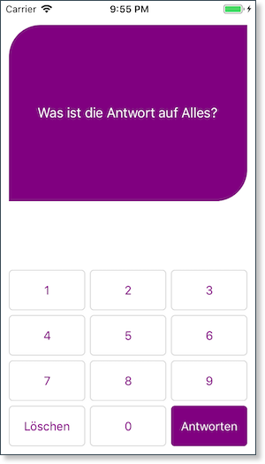
</p>

📺 [Watch demonstration video (spoiler alarm for the answers!)](https://www.youtube.com/watch?v=3tDbkfS11rg&feature=youtu.be)
---

&nbsp;
 

Table of contents
---
- [🚀 Overview](#%f0%9f%9a%80-overview)
- [🏗 Build](#%f0%9f%8f%97-build)
  - [🧾 Documentation](#%f0%9f%a7%be-documentation)
  - [🤖 Android](#%f0%9f%a4%96-android)
  - [📱 iOS](#%f0%9f%93%b1-ios)
- [🚦 Test](#%f0%9f%9a%a6-test)
  - [🧾 Documentation](#%f0%9f%a7%be-documentation-1)
  - [🤖 Android](#%f0%9f%a4%96-android-1)
  - [📱 iOS](#%f0%9f%93%b1-ios-1)
- [🔀 Distribute](#%f0%9f%94%80-distribute)
  - [🧾 Documentation](#%f0%9f%a7%be-documentation-2)
- [📈 Diagnostics](#%f0%9f%93%88-diagnostics)
  - [🧾 Documentation](#%f0%9f%a7%be-documentation-3)
  - [💥 Crash](#%f0%9f%92%a5-crash)
  - [🚨 Error](#%f0%9f%9a%a8-error)
- [📊 Analytics](#%f0%9f%93%8a-analytics)
  - [🧾 Documentation](#%f0%9f%a7%be-documentation-4)
  - [🗺 Overview](#%f0%9f%97%ba-overview)
  - [🎆 Events](#%f0%9f%8e%86-events)

&nbsp;
---
&nbsp;

# 🚀 Overview

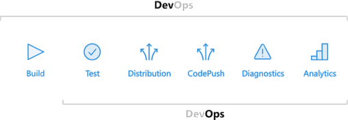


# 🏗 Build

## 🧾 Documentation
- [AppCenter: Build](https://docs.microsoft.com/en-us/appcenter/build/) 
- [Custom Build scripts](https://montemagno.com/vs-app-center-custom-build-scripts-for-production-apps/)

<p>
  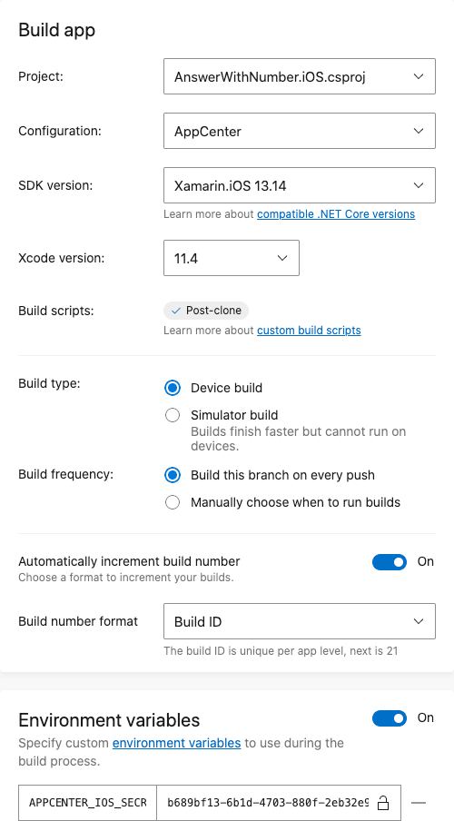
</p>

## 🤖 Android

|Branch | Status |
|--------|--------|
| Dev    |    |
| Master |   |

## 📱 iOS

|Branch | Status |
|--------|--------|
| Dev    |    |
| Master |    |

&nbsp;

# 🚦 Test

## 🧾 Documentation
- [AppCenter: Test](https://docs.microsoft.com/en-us/appcenter/test-cloud/)

Run test on AppCenter via commandline

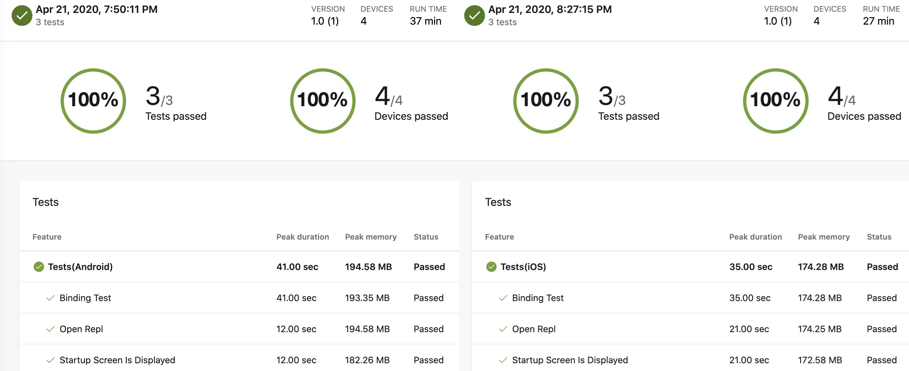

&nbsp;

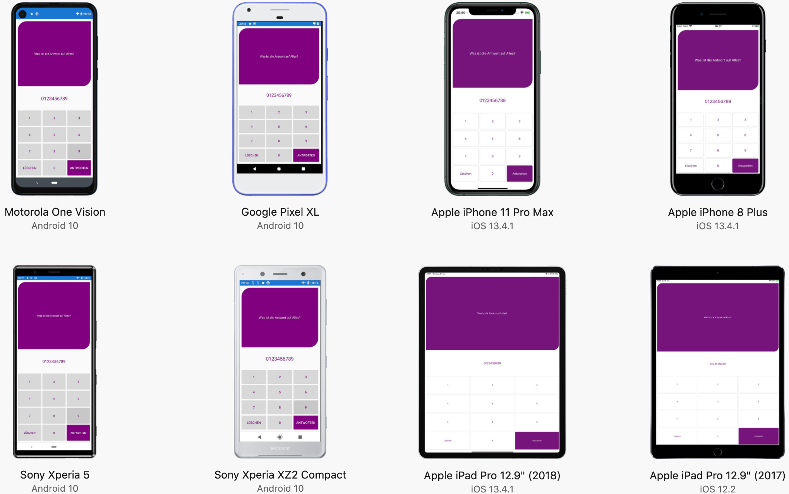

## 🤖 Android

```shell
appcenter test run uitest --app "Suplanus/AnswerWithNumber-Android" --devices "Suplanus/storedeviceset-android" --app-path "/Users/moz/Documents/GitHub/AnswerWithNumber/appcenter/AnswerWithNumber.apk" --test-series "master" --locale "de_DE" --build-dir "/Users/$USER/Documents/GitHub/AnswerWithNumber/src/AnswerWithNumber/AnswerWithNumber.UITest/bin/Debug" --uitest-tools-dir "/Users/$USER/.nuget/packages/xamarin.uitest/3.0.7/tools/"
```

## 📱 iOS

```shell
appcenter test run uitest --app "Suplanus/AnswerWithNumber-iOS" --devices "Suplanus/storedeviceset-ios" --app-path "/Users/moz/Documents/GitHub/AnswerWithNumber/appcenter/AnswerWithNumber.ipa" --test-series "master" --locale "de_DE" --build-dir "/Users/$USER/Documents/GitHub/AnswerWithNumber/src/AnswerWithNumber/AnswerWithNumber.UITest/bin/Debug" --uitest-tools-dir "/Users/$USER/.nuget/packages/xamarin.uitest/3.0.7/tools/"
```

# 🔀 Distribute

## 🧾 Documentation
- [AppCenter: Distribution](https://docs.microsoft.com/en-us/appcenter/distribution/)


# 📈 Diagnostics

## 🧾 Documentation
- [AppCenter: Diagnostics](https://docs.microsoft.com/en-us/appcenter/diagnostics/)

## 💥 Crash
You can made a crash if you enter `1337`... then you are a _l33t-h4xXor_!

There is a [issue](https://github.com/Suplanus/AnswerWithNumber/issues/3) created by AppCenter. There you can see the details of the crash.


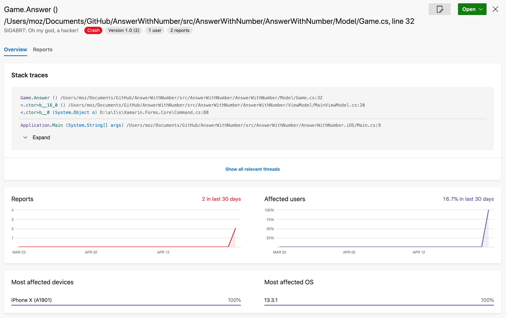

## 🚨 Error
You can made a [`System.OverflowException`](https://docs.microsoft.com/de-de/dotnet/api/system.overflowexception) when you enter a too long number like `66666666666666666666666`. Then you see the error.

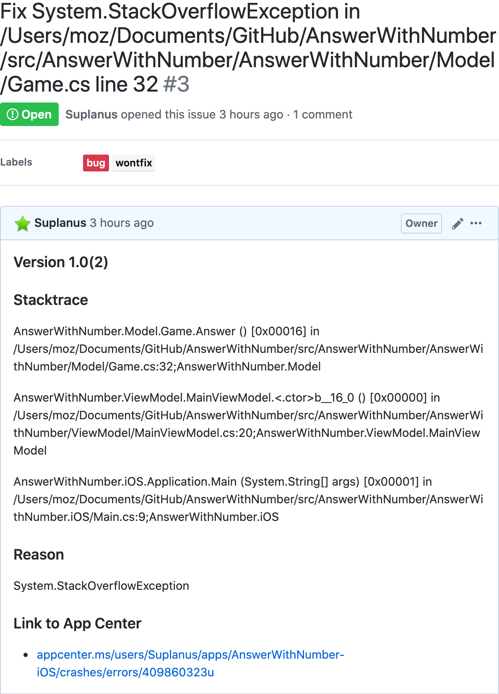

&nbsp;

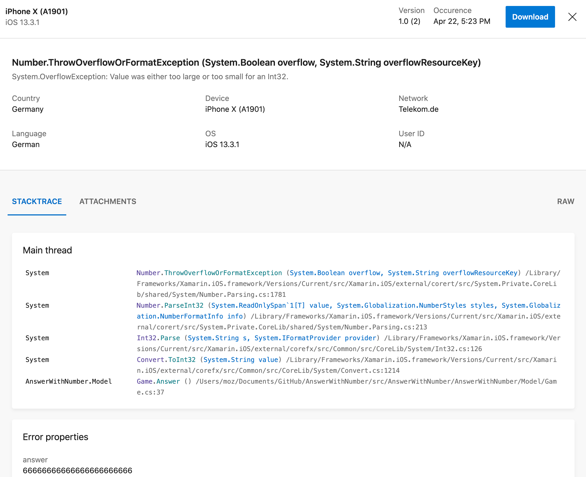

&nbsp;

# 📊 Analytics

## 🧾 Documentation
- [AppCenter: Analytics](https://docs.microsoft.com/en-us/appcenter/analytics/)

## 🗺 Overview

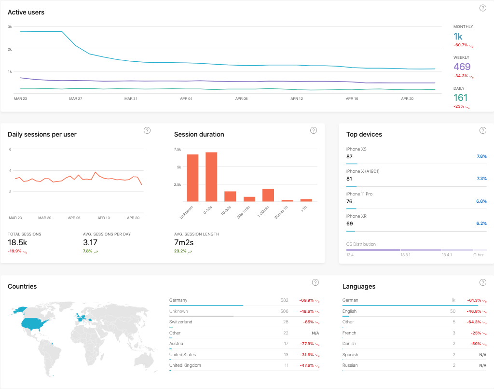

&nbsp;

## 🎆 Events
This events are stored:
- **Difficulty**: If you fail, the level is logged
- **Highscore**: If you win, the time in seconds is logged

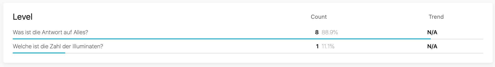

&nbsp;

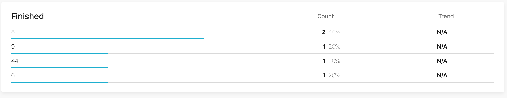