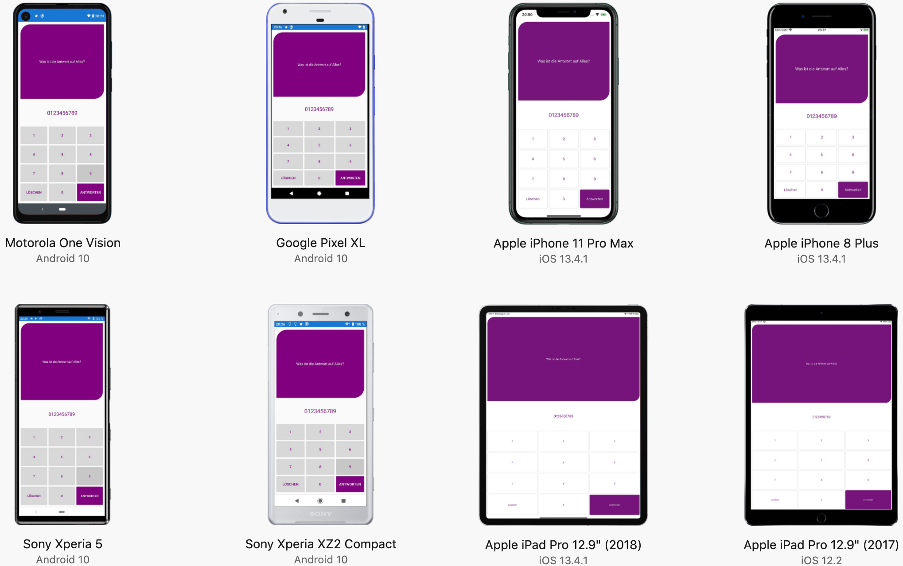

# AnswerWithNumber

<p align="center">
  
</p>

&nbsp;

This is example app to show the [Microsoft AppCenter](https://appcenter.ms) functions in a real world application 🌍

Have fun with it 💕🦄

 &nbsp; 
 
<p align="center">
  
</p>

&nbsp;

## Build

### Status

| Plattform | Branch | Status |
|-----------|--------|--------|
| **Android**   | Dev    | [](https://appcenter.ms)   |
|           | Master | [](https://appcenter.ms)   |
| **iOS**       | Dev    | [](https://appcenter.ms)   |
|           | Master | [](https://appcenter.ms)   |

&nbsp;

## Diagnostics

### Crash
You can made a crash if you enter `1337`... then you are a _l33t-h4xXor_ 👩‍💻

### Error
You can made a [`System.OverflowException`](https://docs.microsoft.com/de-de/dotnet/api/system.overflowexception) when you enter a too long number... Then you see the crash 💥

&nbsp;

## Analytics
This events are stored:
- **Difficulty**: If you fail, the level and the answer is logged
- **Highscore**: If you win, the time is logged

&nbsp;

## Test

Run test on AppCenter via commandline 🔴🟢



### iOS

```shell
appcenter test run uitest --app "Suplanus/AnswerWithNumber-iOS" --devices "Suplanus/storedeviceset-ios" --app-path "/Users/moz/Documents/GitHub/AnswerWithNumber/appcenter/AnswerWithNumber.ipa" --test-series "master" --locale "de_DE" --build-dir "/Users/$USER/Documents/GitHub/AnswerWithNumber/src/AnswerWithNumber/AnswerWithNumber.UITest/bin/Debug" --uitest-tools-dir "/Users/$USER/.nuget/packages/xamarin.uitest/3.0.7/tools/"
```

### Android

```shell
appcenter test run uitest --app "Suplanus/AnswerWithNumber-Android" --devices "Suplanus/storedeviceset-android" --app-path "/Users/moz/Documents/GitHub/AnswerWithNumber/appcenter/AnswerWithNumber.apk" --test-series "master" --locale "de_DE" --build-dir "/Users/$USER/Documents/GitHub/AnswerWithNumber/src/AnswerWithNumber/AnswerWithNumber.UITest/bin/Debug" --uitest-tools-dir "/Users/$USER/.nuget/packages/xamarin.uitest/3.0.7/tools/"
```